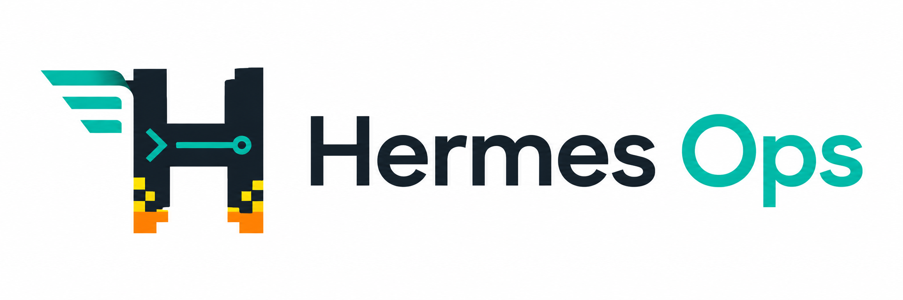
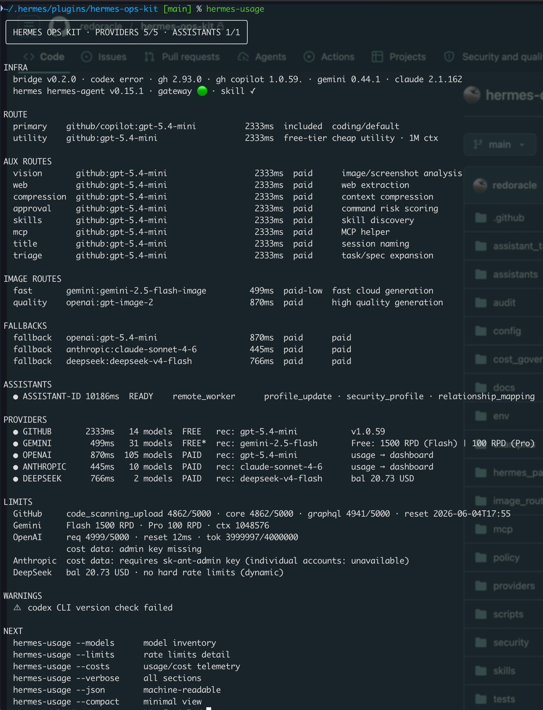
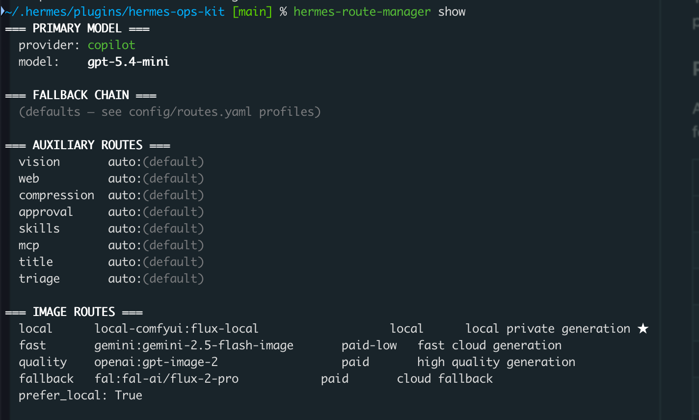
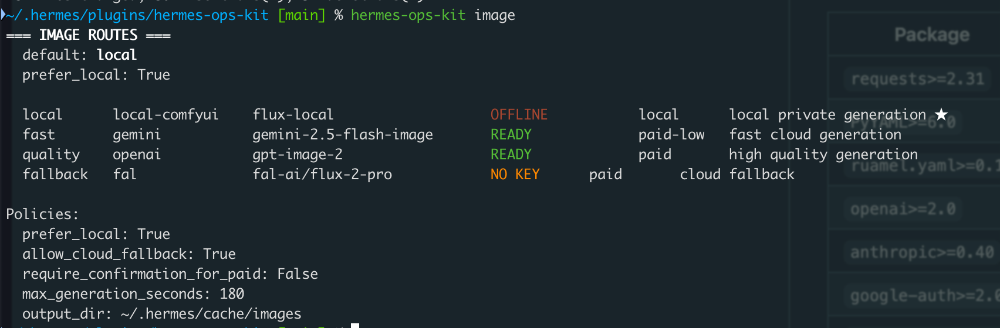

<p align="center">
  
  <h1 align="center">Hermes Ops Kit</h1>
  <p align="center">
    <strong>Operational &amp; security plugin for Hermes Agent</strong><br>
    secret lifecycle · provider health · route profiles · plugin security · MCP audit · cost observability
  </p>
</p>

<p align="center">
  <a href="https://pypi.org"></a>
  <a href="./LICENSE"></a>
  <a href="https://github.com/NousResearch/hermes-agent"></a>
  <a href="./CHANGELOG.md"></a>
  <a href="#tests"></a>
  <a href="./CODE_OF_CONDUCT.md"></a>
</p>

---

Hermes Ops Kit is the operational companion for
[Hermes Agent](https://github.com/NousResearch/hermes-agent). It adds
production-grade credential management, provider health monitoring, route
diagnostics, MCP security auditing, and cost observability — all backed by
a self-hosted Bitwarden/Vaultwarden secret store with a strict zero-leak redaction
pipeline.

**Ops-kit is an optional plugin.** Hermes works perfectly without it. When
you need key rotation, budget enforcement, or a security audit trail, ops-kit
plugs into the native Hermes plugin system and stays out of your way.

## Screenshots

<p align="center">
  
  
</p>
<p align="center">
  
</p>

| Command                       | What it shows                                                                                                           |
| ----------------------------- | ----------------------------------------------------------------------------------------------------------------------- |
| `hermes-usage`                | Multi-provider health dashboard — online/offline status, rate limits, costs, and model inventory across all 6 providers |
| `hermes-route-manager show`   | Current routing configuration — primary, utility, auxiliary, and fallback routes with provider assignments              |
| `hermes-ops-kit image routes` | Image generation routes — local ComfyUI, Gemini, OpenAI, and FAL.ai backends with status and cost class                 |

## Table of contents

- [What it does](#what-it-does)
- [What it does not replace](#what-it-does-not-replace)
- [Quick start](#quick-start)
- [Installation](#installation)
- [Command reference](#command-reference)
  - [Key rotation](#key-rotation)
  - [Usage metrics](#usage-metrics)
  - [Route manager](#route-manager)
  - [Image routes](#image-routes)
  - [Assistant manager](#assistant-manager)
  - [MCP auditor](#mcp-auditor)
  - [Plugin security scanner](#plugin-security-scanner)
- [Secret backend](#secret-backend)
- [Security](#security)
- [Architecture](#architecture)
- [Repository map](#repository-map)
- [Documentation](#documentation)
- [Testing](#testing)
- [Contributing](#contributing)
- [License](#license)

## What it does

| Area              | Capabilities                                                                                                        |
| ----------------- | ------------------------------------------------------------------------------------------------------------------- |
| **Secrets**       | Bitwarden/Vaultwarden-backed store · 3 auth modes · atomic chmod-600 writes · classification (admin/runtime/config) |
| **Key Rotation**  | 6 providers · 14-phase state machine · retry+rollback · per-provider locking · orphan cleanup · emergency mode      |
| **Validation**    | Structured results (`reason_class`, `http_status`, `retry_recommended`) — "unusable" never "expired"                |
| **Env Rendering** | 3-layer denylist gate — admin keys can never leak into `.env.generated`                                             |
| **Health**        | Concurrent live probes across all providers · rate limits · costs                                                   |
| **Routing**       | Profile presets (cheap / balanced / max-quality) · fallback chains                                                  |
| **Image Gen**     | Separate routing layer — ComfyUI · Gemini · DALL-E · FAL.ai                                                         |
| **Assistants**    | Config-driven delegation to remote Hermes agents · policy engine                                                    |
| **MCP Audit**     | Server discovery · tool risk classification · atomic whitelisting                                                   |
| **Plugin Scan**   | Pre-execution security scan · entropy check · skill vs code detection · rule overrides · doc/test downgrades        |
| **Security**      | 16-pattern redaction · secret scanner gate · safe `bw` CLI wrapper                                                  |

## What it does not replace

Ops-kit is an **operational layer** — it never touches the Hermes runtime
core. When a capability already exists in Hermes, ops-kit integrates with
it rather than reimplementing it.

> **Does not replace:** model invocation · runtime routing · memory ·
> skills · scheduler · gateway · auxiliary route resolution

See [`docs/Hermes Compatibility.md`](docs/Hermes%20Compatibility.md) for the
full plugin contract — every config key touched, every file written, and
rollback guarantees.

## Quick start

```bash
# Install
curl -fsSL https://raw.githubusercontent.com/redoracle/hermes-ops-kit/main/install.sh | bash

# Full system diagnostic
hermes-ops-kit doctor

# Provider health at a glance
hermes-usage --compact

# Seed a key into Bitwarden/Vaultwarden
echo "sk-..." | hermes-key-rotate --provider openai --manual-new-key-stdin

# Bulk-migrate all keys from .env
hermes-key-rotate seed-from-env

# Validate before storing
echo "sk-..." | hermes-key-rotate validate --provider openai

# Rotate all providers in parallel
hermes-key-rotate rotate --provider all --parallel

# See current routing
hermes-route-manager show

# Apply a cost-optimized profile
hermes-route-manager apply-profile cheap

# Key fingerprints and age
hermes-key-rotate --status
```

## Installation

<p><details><summary><b>All installation methods</b></summary>

`install.sh` supports Linux, macOS, and Windows through WSL. It requires
Python 3.11+, pip, Git, and Bash. Native Windows PowerShell/cmd is not
supported by the Bash installer. When run inside a virtual environment, the
installer keeps dependencies and generated CLI wrappers pinned to that
environment; otherwise it uses the current user's Python package site.

For Windows, clone the repository inside WSL and run `bash install-wsl.sh`.
The WSL bootstrap installs Python, pip, Git, and Go through `apt-get`, then
delegates to `install.sh`.

The installer performs a complete self-scan before dependency installation.
The official repository is trusted after a scan completes without errors
because this security toolkit intentionally contains privileged operations and
detector fixtures. Custom `HERMES_OPS_KIT_REPO` sources fail closed on risky
findings unless the operator explicitly sets `HERMES_OPS_KIT_TRUST_REPO=true`.

```bash
# Remote install (recommended)
curl -fsSL https://raw.githubusercontent.com/redoracle/hermes-ops-kit/main/install.sh | bash

# Pinned version
HERMES_OPS_KIT_VERSION=v0.2.0 bash -c "$(curl -fsSL https://raw.githubusercontent.com/redoracle/hermes-ops-kit/main/install.sh)"

# Git clone + plugin registration
git clone https://github.com/redoracle/hermes-ops-kit.git ~/.hermes/plugins/hermes-ops-kit
hermes plugins enable hermes-ops-kit

# Pip install (library use)
pip install git+https://github.com/redoracle/hermes-ops-kit.git

# Uninstall
bash uninstall.sh               # Keep config + env
bash uninstall.sh --purge        # Also remove config
bash uninstall.sh --purge-env   # Also remove ~/.hermes/.env (destructive)
```

The [plugin manifest](plugin.yaml) (`plugin.yaml`) declares 7 tools, 2 hooks,
and 1 CLI command registered with the Hermes plugin loader at startup.

The installer enables the plugin, which automatically registers a cached,
report-only security scan on Hermes `on_session_start`. No `hooks:` entry is
added to `~/.hermes/config.yaml`; that block is reserved for shell-command
hooks. To prevent unsafe plugins from loading, run `hermes-ops-kit preflight`
before starting Hermes or configure it as a supervisor pre-start command.
A normal `hermes gateway restart` does **not** run preflight. Use
`hermes-ops-kit preflight && hermes gateway restart` for a one-off safe restart.

### Python dependencies

All provider SDKs are included as core dependencies — `pip install hermes-ops-kit`
installs everything needed for full functionality across all 6 providers.
`install.sh` installs the `dev` extra as well and verifies both Pillow and
`ruff`, plus Semgrep and Bandit. It also installs pinned Gitleaks `v8.30.1`
through Go, or the package-managed Gitleaks version through
Homebrew/Linuxbrew when Go is unavailable.

| Package             | Required for                                                  |
| ------------------- | ------------------------------------------------------------- |
| `requests>=2.31`    | Google validation, admin API calls, GitHub curl fallback      |
| `PyYAML>=6.0`       | Config parsing (assistants.yaml, routes.yaml, env_projection) |
| `ruamel.yaml>=0.18` | YAML round-trip with comment preservation                     |
| `openai>=2.0`       | OpenAI + DeepSeek validation, NVIDIA NIM API (OpenAI-compat)  |
| `anthropic>=0.40`   | Anthropic validation & smoke test                             |
| `google-auth>=2.0`  | Google auto-creation via API Keys API (ADC)                   |
| `google-genai>=1.0` | Gemini image generation (Nano Banana)                         |
| `PyJWT>=2.8`        | GitHub App RS256 JWT token minting                            |
| `Pillow>=10.0`      | Image metadata and format handling                            |
| `fal-client>=0.6`   | FAL.ai Flux/Stable Diffusion cloud fallback                   |

```bash
pip install hermes-ops-kit  # everything included
```

**System tools** (not Python packages):

| Tool     | Required for                         | Install                      |
| -------- | ------------------------------------ | ---------------------------- |
| `bw` CLI | Bitwarden/Vaultwarden secret backend | `brew install bitwarden-cli` |
| `gh` CLI | GitHub validation (fallback: curl)   | `brew install gh`            |

</details></p>

## Command reference

### Key rotation

```bash
# ── Status & diagnostics ──
hermes-key-rotate --status                            # Fingerprints + age report
hermes-key-rotate --render-env                        # Generate ~/.hermes/.env.generated
hermes-key-rotate --doctor-secrets                    # Full diagnostic

# ── Seed API keys (first time or after expiration) ──
echo "sk-..." | hermes-key-rotate --provider openai --manual-new-key-stdin
hermes-key-rotate --provider openai                   # Interactive TTY prompt

# ── Seed admin keys (enables full-auto rotation) ──
echo "sk-admin-..." | hermes-key-rotate seed-admin --provider openai --project-id "proj_xxx"
echo "sk-ant-admin-..." | hermes-key-rotate seed-admin --provider anthropic --workspace-id "ws_xxx"
echo "..." | hermes-key-rotate seed-admin --provider google --project-number "123456"

# ── Rotation (new subcommands) ──
hermes-key-rotate rotate --provider openai            # Interactive (admin→auto, or prompts)
hermes-key-rotate rotate --provider all               # All providers sequentially
hermes-key-rotate rotate --provider all --parallel    # All concurrently (per-provider locks)
hermes-key-rotate rotate --dry-run --provider openai  # Preview without mutating

# ── Validate a key without storing ──
echo "sk-..." | hermes-key-rotate validate --provider openai
# Returns: {valid, reason_class, http_status, retry_recommended}

# ── Emergency key compromise ──
echo "new-key" | hermes-key-rotate emergency --provider openai --yes-i-understand-downtime-risk
hermes-key-rotate emergency --provider openai --revoke-only --yes-i-understand-downtime-risk

# ── Bulk migrate from .env ──
hermes-key-rotate seed-from-env --dry-run           # Preview what would be imported
hermes-key-rotate seed-from-env                     # Migrate all runtime keys to Bitwarden/Vaultwarden

# ── Crash recovery ──
hermes-key-rotate resume --provider openai            # Resume from checkpoint

# ── Vault management ──
hermes-key-rotate backup-vault                        # Export vault metadata to backup JSON
hermes-key-rotate restore-vault <file> --dry-run      # Verify backup integrity
hermes-key-rotate diff                                # Compare vault vs .env vs .env.generated
hermes-key-rotate migrate                             # Interactive migration wizard
```

**Subcommands** (new structured interface — flat flags still work):

| Command         | Purpose                                                            |
| --------------- | ------------------------------------------------------------------ |
| `rotate`        | Rotate API keys (single, all, parallel)                            |
| `seed-admin`    | Store admin credentials for auto-rotation                          |
| `seed-from-env` | Bulk-migrate all runtime keys from `.env` to Bitwarden/Vaultwarden |
| `emergency`     | Immediate revoke + replace on key compromise                       |
| `resume`        | Resume interrupted rotation from checkpoint                        |
| `validate`      | Probe a key against the provider API without storing               |
| `render-env`    | Generate `.env.generated`                                          |

### Vault management

| Command                | Description                                                                     |
| ---------------------- | ------------------------------------------------------------------------------- |
| `backup-vault`         | Export all 9 refs (fingerprints only) to `~/.hermes/ops-kit/vault-backup.json`  |
| `restore-vault <file>` | Verify backup integrity against current vault                                   |
| `diff`                 | Compare Bitwarden/Vaultwarden vs `.env` vs `.env.generated`, show discrepancies |
| `migrate`              | One-shot migration wizard: scan → seed → render → verify                        |

**Security guarantees:**

- **Admin keys never leak** — three-layer denylist gate (YAML `deny_render` list + path classification + metadata flag) prevents admin credentials from appearing in `.env.generated`.
- **Structured validation** — `validate_new_key()` returns typed `ValidationResult` with `reason_class` (`auth_denied`, `rate_limited`, `network_error`, etc.). Transient failures retried with exponential backoff; permanent failures return immediately. Says "candidate key unusable" — never claims "expired" unless the provider says so.
- **Rollback** — `backup_secret()` before mutation → `restore_secret()` on smoke-test or env-render failure. Old key never revoked before replacement is confirmed healthy.
- **Per-provider locking** — `fcntl.flock` via `security/lockfile.py` prevents concurrent rotations of the same provider.
- **State machine** — 14-phase rotation with checkpointing to `~/.hermes/rotation_checkpoints/`. Crashed rotations resume via `hermes-key-rotate resume`.
- **Orphan cleanup** — auto-created keys that fail validation are deleted from the provider.
- **Secret classification** — every Bitwarden/Vaultwarden item carries `secret_class` (`runtime`/`admin`/`config`) and `renderable_to_env` in custom fields.
- **GitHub token validation** — GitHub tokens validated via `gh` CLI or `curl` fallback — no `gh` install required.

**Bitwarden/Vaultwarden ref layout:**

```text
hermes/openai/api_key         ← runtime (rendered into .env.generated)
hermes/openai/admin_key       ← admin (NEVER rendered 🛡️)
hermes/openai/project_id      ← config (rendered)
hermes/anthropic/admin_key    ← admin (NEVER rendered 🛡️)
hermes/anthropic/workspace_id ← config (rendered)
hermes/google/gemini_api_key  ← runtime (rendered)
hermes/google/admin_key       ← admin (NEVER rendered 🛡️)
hermes/google/project_number  ← config (rendered)
hermes/deepseek/api_key       ← runtime (rendered)
hermes/github/token           ← runtime (rendered)
hermes/nvidia/api_key         ← runtime (rendered)
```

Use `hermes-key-rotate --status` to see fingerprints and `render-env`
to generate `.env.generated`. Admin refs are blocked by the 3-layer
denylist — they can never leak into runtime files.

Configuration: [`config/env_projection.yaml`](config/env_projection.yaml) defines 23 env-var → secret-ref mappings plus a `deny_render` blocklist. See [`docs/architecture.md`](docs/architecture.md).

### Usage metrics

```bash
hermes-usage                          # Rich terminal dashboard
hermes-usage --compact                # Minimal routing view
hermes-usage --json                   # Machine-readable
hermes-usage --limits                 # Rate limit details
hermes-usage --costs                  # Cost telemetry (needs admin keys)
hermes-usage -p openai                # Single provider
hermes-usage --plain                  # ASCII, no Unicode
```

Concurrent provider health probes. Tracks rate limits (GitHub core, Gemini
RPD, OpenAI headers, DeepSeek balance), usage costs (OpenAI + Anthropic
admin APIs), and CLI versions (codex, gh, gh copilot, gemini, claude).

### Route manager

```bash
hermes-route-manager show                          # Current routing config
hermes-route-manager apply-profile cheap           # Budget-optimized
hermes-route-manager apply-profile balanced        # Default all-rounder
hermes-route-manager apply-profile max-quality     # Best available models
hermes-route-manager set-primary copilot gpt-5.4-mini
hermes-route-manager fallback add openai gpt-5.4-mini
hermes-route-manager doctor                        # Validate configuration
```

Reads `~/.hermes/config.yaml` as the authoritative source of truth.
Profiles patch native Hermes config keys — Hermes never needs to read
ops-kit files. Design: [`docs/Route Profile Design.md`](docs/Route%20Profile%20Design.md).

Configuration: [`config/routes.yaml`](config/routes.yaml).

### Image routes

```bash
hermes-ops-kit image routes                        # List routes + status
hermes-ops-kit image test "a cat wearing a hat"    # Test with default route
hermes-ops-kit image test "..." --route quality     # Specific route
hermes-ops-kit image set-default local              # Prefer local ComfyUI
hermes-ops-kit image doctor                        # Validate + backend health
```

Separate routing layer from LLM text routes. Local ComfyUI (private),
Gemini 2.5 Flash Image (fast), OpenAI gpt-image-2 (quality), FAL.ai (cloud
fallback). Priority-based with `prefer_local` policy.

Configuration: [`config/image_routes.yaml`](config/image_routes.yaml).
The `OpsKitRouterProvider` (in `image_routes/hermes_provider.py`) self-registers
via the plugin's `register()` function — no separate plugin needed.

### Assistant manager

```bash
hermes-assistant-manager list --json
hermes-assistant-manager get <assistant-id>
hermes-assistant-manager validate
hermes-assistant-manager doctor
hermes-assistant-manager ping <assistant-id>
hermes-assistant-manager backup
```

Config-driven delegation to remote Hermes agent runtimes. Capabilities,
policy, and security constraints are defined per-assistant in YAML —
zero code for new assistants.

Configuration: [`config/assistants.yaml`](config/assistants.yaml),
[`config/assistant_tasks.yaml`](config/assistant_tasks.yaml).
See [`examples/`](examples/) for annotated templates.

### MCP auditor

```bash
hermes-ops-kit mcp audit                    # Full tool security audit
hermes-ops-kit mcp risks                    # Risk summary
hermes-ops-kit mcp approve --server <id>    # Whitelist server
hermes-ops-kit mcp approve --all            # Whitelist all
hermes-ops-kit mcp revoke                   # Clear all approvals
```

Classifies MCP tools by capability: critical → blocked, high → approval
required. Policy: [`policy/rules.yaml`](policy/rules.yaml), persisted as
`~/.hermes/mcp_policy.json`. `hermes-ops-kit preflight` enforces the audit by
disabling unsafe MCP servers before Hermes boots.

### Plugin security scanner

```bash
hermes-ops-kit plugin scan                                    # Default startup scan
hermes-ops-kit plugin scan --plugin <name> --force            # Single plugin, skip cache
hermes-ops-kit plugin scan --profile manual --json            # Full scan, JSON output
hermes-ops-kit plugin policy                                  # Show approval policy
hermes-ops-kit plugin approve <plugin>                        # Approve entire plugin
hermes-ops-kit plugin override <plugin> <rule> allow          # Whitelist a single rule
hermes-ops-kit plugin override --show                         # List all overrides
hermes-ops-kit preflight --dry-run                            # Preview enforcement (no changes)
hermes-ops-kit preflight                                      # Scan + enforce config sync
```

Pre-execution security scan for all Hermes plugins. Detects hardcoded
secrets, dangerous code patterns, and prompt injection using regex, AST
analysis, and optional Semgrep/gitleaks/Bandit integration.

**Anti-false-positive measures:** Shannon entropy check distinguishes
real keys from test fixtures; doc/skill files get reduced severity;
rule overrides provide fine-grained per-rule per-plugin control.

**Preflight enforcement:** `hermes-ops-kit preflight` synchronizes scanner
decisions with `~/.hermes/config.yaml` before Hermes boots — blocked plugins
are excluded from loading. Adds ~12s to boot with cold cache, ~1-2s with
warm cache. Skip with `hermes gateway run` directly if boot speed is critical.

**Disable-by-default:** Medium+ risk plugins are disabled until approved.
0 blocked plugins in the current production scan (down from 12 before tuning).

Policy: [`policy/rules.yaml`](policy/rules.yaml) + `~/.hermes/ops-kit/plugin_policy.json`.
Docs: [`docs/plugin-security-scanner.md`](docs/plugin-security-scanner.md).
Test: `bash scripts/test-scanner.sh` (10-test integration suite).

## Secret backend

Ops-kit uses a self-hosted Vaultwarden/Bitwarden server as its canonical
secret store. Provider API keys are stored **encrypted at rest** (AES-256)
and **encrypted in transit** (TLS 1.3). Credentials never appear in source
files, git, logs, audit trails, or Obsidian — only sha256 fingerprints and
`last4` identifiers appear in output.

### Security model ("secret zero")

The architecture follows the same pattern as HashiCorp Vault and AWS
Secrets Manager:

```text
~/.hermes/.env (chmod 600)          ~/.hermes/.env.generated (chmod 600)
┌─────────────────────────┐         ┌──────────────────────────────┐
│ 4 bootstrap vars only   │         │ Runtime keys (rendered)      │
│ VAULTWARDEN_SERVER_URL  │  bw     │ OPENAI_API_KEY="sk-..."      │
│ VAULTWARDEN_USER        │ unlock  │ GEMINI_API_KEY="AQ.A..."     │
│ VAULTWARDEN_PASSWORD    │────────→│ DEEPSEEK_API_KEY="sk-..."    │
│ BW_SESSION (short-lived)│         │ ANTHROPIC_API_KEY="sk-ant-"  │
│                         │         │                              │
│ NO provider API keys    │         │ Admin keys: NEVER rendered   │
└─────────────────────────┘         └──────────────────────────────┘
         │                                        ↑
         │  bw CLI (TLS 1.3)                      │  render-env
         ▼                                        │
┌─────────────────────────────────────────────────────────────┐
│  Bitwarden/Vaultwarden (self-hosted)                        │
│  ┌───────────────────────────────────────────────────────┐  │
│  │ hermes/openai/api_key         ← encrypted at rest     │  │
│  │ hermes/google/gemini_api_key  ← encrypted at rest     │  │
│  │ hermes/deepseek/api_key       ← encrypted at rest     │  │
│  │ hermes/anthropic/api_key      ← encrypted at rest     │  │
│  │ hermes/openai/admin_key       ← NEVER rendered        │  │
│  └───────────────────────────────────────────────────────┘  │
└─────────────────────────────────────────────────────────────┘
```

A single bootstrap credential (`BW_SESSION`) unlocks all keys — and
it's short-lived (daily expiry), revocable, and never written to git.
Contrast with the old approach of 10+ long-lived API keys sitting in
a single `.env` file forever.

### Migration from `.env`

```bash
# 1. Seed each provider key into Bitwarden/Vaultwarden
echo "sk-..." | hermes-key-rotate rotate --provider openai --manual-new-key-stdin
echo "..."   | hermes-key-rotate rotate --provider anthropic --manual-new-key-stdin
echo "..."   | hermes-key-rotate rotate --provider google --manual-new-key-stdin
echo "sk-..." | hermes-key-rotate rotate --provider deepseek --manual-new-key-stdin

# 2. Seed admin keys (enables auto-creation + revocation)
echo "sk-admin-..." | hermes-key-rotate seed-admin --provider openai --project-id "proj_xxx"

# 3. Verify
hermes-key-rotate --status     # all 4+ refs present
hermes-key-rotate render-env   # generates .env.generated

# 4. Remove API keys from ~/.hermes/.env, keep only bootstrap vars
```

### Setup

```bash
bw config server "$(grep '^VAULTWARDEN_SERVER_URL=' ~/.hermes/.env | cut -d= -f2-)"
bw login "$(grep '^VAULTWARDEN_USER=' ~/.hermes/.env | cut -d= -f2-)"
bw unlock
```

Bootstrap `~/.hermes/.env` (chmod 600) — **only these 4-6 vars**:

```env
HERMES_SECRET_BACKEND=vaultwarden
VAULTWARDEN_SERVER_URL=https://<your-vaultwarden-host>
VAULTWARDEN_USER=<email>
VAULTWARDEN_PASSWORD=<master-password>
HERMES_AUTH_MODE=bitwarden_cli_session
BW_SESSION=<session-key>
```

Three auth modes: password bootstrap, API key (`BW_CLIENTID` +
`BW_CLIENTSECRET`), and session token. Session tokens expire
periodically — refresh with `bw unlock`.

See [`skills/bw/SKILL.md`](skills/bw/SKILL.md) and
[`skills/operator/`](skills/operator/) for Bitwarden/Vaultwarden operational guides.

## Security

> **Defense-in-depth, not a silver bullet.** Ops-kit adds multiple security
> layers that were missing before — secret rotation, plugin scanning, MCP
> auditing, redaction — but it cannot guarantee absolute protection. Every
> layer reduces risk; none eliminates it. Treat this as one control in a
> broader security posture, not a replacement for code review, network
> segmentation, or the principle of least privilege.

### Secret protection pipeline

- **"Secret zero" architecture** — 4 bootstrap vars in `.env` unlock an
  AES-256 encrypted store; API keys never touch `.env` and can be rotated
  without editing files
- **3-layer admin denylist** — `hermes/*/admin_key` refs can never leak into
  `.env.generated` (YAML blocklist + path classification + metadata flag)
- **16-pattern redaction** — all stdout/stderr/logs pass through
  `security/redaction.py`
- **Secret scanner gate** — `assert_clean()` blocks any content containing
  secret-like patterns before reaching disk
- **Two-phase rotation** — backup → store → smoke → activate → revoke;
  `backup_secret()`/`restore_secret()` rollback on failure
- **Per-provider locking** — `fcntl.flock` prevents concurrent rotations of
  the same provider
- **Atomic env writes** — temp → chmod 600 → fsync → atomic rename
  (`env/atomic_write.py`)
- **Safe `bw` wrapper** — list args only, stdin auth, forbidden commands
  blocked, TLS verified (`security/bitwarden_cli_client.py`)
- **Classification metadata** — every secret carries `secret_class`
  (`runtime`/`admin`/`config`) and `renderable_to_env` in Bitwarden/Vaultwarden
  custom fields
- **Read-only by default** for remote assistants

### Plugin security scanner

Pre-execution scanning of all Hermes plugins and skills. Detects hardcoded
secrets, dangerous code patterns, and prompt injection before plugins are
loaded — plugins with critical findings are blocked from execution.

- **Built-in detection:** 16 regex patterns + AST analysis + Shannon entropy
  check + sequential/dummy pattern detection + prompt injection regex
- **Optional external tools:** [gitleaks](https://github.com/gitleaks/gitleaks)
  (150+ secret detectors), [Semgrep](https://semgrep.dev) (2,500+ SAST rules),
  [Bandit](https://bandit.readthedocs.io) (Python security rules)
- **Auto-detection:** the scanner checks for external tools at runtime and
  uses them if available; degrades gracefully if they are not installed
- **Skill vs Code:** auto-classifies plugins as code (executable) or skill
  (AI context) and applies appropriate risk thresholds

> **⚠️ External tools are NOT auto-installed.** `pip install hermes-ops-kit`
> does not install gitleaks, Semgrep, or Bandit. These must be installed
> separately if you want enhanced detection. See the platform-specific
> guide: [`docs/external-security-tools.md`](docs/external-security-tools.md).

### MCP security auditing

Audits MCP (Model Context Protocol) tools across all configured servers for
security risks before Hermes invokes them:

- **Server discovery** — enumerates all configured MCP servers and their tools
- **Capability classification** — network access, file system writes, shell
  execution, credential access, dynamic imports
- **Risk-based policy** — critical findings block the tool; high findings
  require explicit approval; medium findings disable by default
- **Atomic whitelisting** — `mcp approve --server <id>` permits all tools
  from a server; `--tool <id>` permits individual tools; `revoke` clears all
- **Pre-boot enforcement** — incomplete audits and unapproved high-risk tools
  disable the server; critical tools block boot
- **Policy persistence** — owner-only atomic `~/.hermes/mcp_policy.json`

### What ops-kit cannot protect against

Ops-kit scans source code at rest — it does not provide runtime monitoring,
sandbox execution (Phase 3), or behavioral analysis. Specifically:

- **Novel attacks** — zero-day exploits, polymorphic malware, and time bombs
  may evade static analysis
- **Supply chain** — compromised dependencies are not scanned in MVP (Phase 2)
- **Runtime behavior** — the scanner cannot observe what a plugin does when
  executed; Docker sandbox is a planned Phase 3 feature
- **Trusted insider** — an operator with shell access and `bw unlock` can
  read and exfiltrate secrets through the legitimate Bitwarden/Vaultwarden CLI

These are inherent limitations of static analysis, not gaps unique to ops-kit.
Every SAST tool has the same constraints.

Report vulnerabilities via [`SECURITY.md`](SECURITY.md). Full security
model and trust boundaries: [`docs/Threat Model.md`](docs/Threat%20Model.md).
Scanner documentation: [`docs/plugin-security-scanner.md`](docs/plugin-security-scanner.md).
External tools: [`docs/external-security-tools.md`](docs/external-security-tools.md).

## Architecture

```text
bridge.py                  Main CLI — subprocess dispatcher
hermes_key_rotate.py       Key rotation CLI (rotate, validate, seed, emergency, backup, restore, diff, migrate, render, status)
usage_metrics_v2.py        Health / limits / usage / costs
hermes_route_manager.py    Route configuration (text + image)
hermes_assistant_manager.py Assistant registry + ping + discover
hermes_skill_factory.py    SKILL.md generator
hermes_export.py           Structured export (usage, security, audit, briefings)

security/                  Bitwarden/Vaultwarden backend · redaction · fingerprints · lockfile
env/                       Env loading · rendering (3-layer denylist) · atomic writes
providers/                 6 LLM adapters + 6 rotators + state machine
assistants/                Config-driven delegation (8 modules)
image_routes/              Image gen routing + 4 adapters (ComfyUI, Gemini, OpenAI, FAL)
security/plugin_scanner/   Pre-execution plugin security scan (entropy, doc-mode, skill-mode)
mcp/                       Tool auditor + risk classifier
policy/                    Centralized engine + declarative rules
audit/                     Sanitized JSONL audit logs (phase-tracked)
cost_governor/             Budget enforcement
ui/                        Terminal UI — rich / compact / json / plain
```

Full module map and data flow: [`docs/architecture.md`](docs/architecture.md).

## Repository map

```text
├── README.md                               ← This file
├── LICENSE                                 ← MIT
├── CHANGELOG.md                            ← Release history
├── SECURITY.md                             ← Vulnerability reporting
├── CONTRIBUTING.md                         ← Dev setup + PR process
├── CODE_OF_CONDUCT.md                      ← Contributor Covenant 2.1
├── plugin.yaml                             ← Hermes plugin manifest
├── pyproject.toml                          ← Python package config
├── Makefile                                ← Dev targets (lint, test, clean)
│
├── config/                                 ← Runtime config templates
│   ├── assistants.yaml                     ← Assistant registry
│   ├── assistant_tasks.yaml                ← Scheduled task profiles
│   ├── routes.yaml                         ← Route profiles + labels
│   ├── image_routes.yaml                   ← Image generation routes
│   ├── env_projection.yaml                 ← Env-var → secret-ref mapping
│   └── budget.yaml                         ← Cost limits
│
├── examples/                               ← Annotated config templates
│   ├── assistants.yaml
│   ├── routes.yaml
│   ├── image_routes.yaml
│   ├── env_projection.yaml
│   ├── budget.yaml
│   └── .env.example                        ← Bootstrap env template
│
├── docs/                                   ← Extended documentation
│   ├── architecture.md                     ← Module map + data flow
│   ├── Hermes Compatibility.md             ← Plugin contract
│   ├── Threat Model.md                     ← Security model
│   ├── Route Profile Design.md             ← Routing architecture
│   ├── Key Management Lifecycle.md         ← Secret lifecycle
│   ├── Architecture Decisions.md           ← Key ADRs
│   ├── Operations Runbook.md               ← Incident response
│   ├── plugin-security-scanner.md          ← Scanner docs + anti-FP tuning
│   ├── external-security-tools.md          ← Semgrep/gitleaks/Bandit install guide
│   └── quickstart.md                       ← Getting started
│
├── skills/                                 ← Bundled Hermes skills
│   ├── hermes-ops-kit/SKILL.md             ← Operator workflows
│   ├── hermes-key-rotate/SKILL.md          ← Key rotation guide
│   ├── bw/SKILL.md                         ← Bitwarden CLI reference
│   └── operator/                           ← Bitwarden/Vaultwarden operational guides
│
├── scripts/
│   ├── preflight-scan.sh                   ← Pre-release secret audit
│   └── test-scanner.sh                     ← 10-test scanner integration suite
│
├── hermes_patches/                         ← Hermes core bridge patches
│   └── README.md
│
├── .github/                                ← CI/CD + community
│   ├── workflows/ci.yml                    ← Tests + lint
│   ├── workflows/security.yml              ← Gitleaks + dependency review
│   ├── dependabot.yml
│   ├── ISSUE_TEMPLATE/
│   └── pull_request_template.md
│
├── tests/                                  ← 194 pytest tests + 8 simulator scenarios
│   ├── test_security.py                    ← 32 tests
│   ├── test_snapshots.py                   ← 14 tests
│   ├── test_simulator.py                   ← 8 scenarios (run separately)
│   ├── test_plugin_scanner.py              ← 110 scanner tests
│   ├── test_route_runtime_harness.py       ← 6 tests
│   ├── test_background_edit.py             ← 4 tests (requires Pillow)
│   └── cli/                                ← 28 CLI integration tests
│
└── policy/
    └── rules.yaml                          ← Declarative security rules
```

## Documentation

| Document                                                                   | Content                                                                                                                              |
| -------------------------------------------------------------------------- | ------------------------------------------------------------------------------------------------------------------------------------ |
| [`docs/Hermes Compatibility.md`](docs/Hermes%20Compatibility.md)           | Plugin contract · config keys touched · files written · rollback guarantees · env var requirements · version compatibility matrix    |
| [`docs/Threat Model.md`](docs/Threat%20Model.md)                           | Trust boundaries · secret lifecycle threats · key rotation mitigations · MCP security · redaction pipeline · atomic write guarantees |
| [`docs/Route Profile Design.md`](docs/Route%20Profile%20Design.md)         | AUX vs IMAGE routes · profile presets · fallback chain design · `apply-profile` flow · custom profiles                               |
| [`docs/architecture.md`](docs/architecture.md)                             | Module map · data flow diagrams · SecretBackend protocol · plugin lifecycle hooks · subprocess adapter pattern                       |
| [`docs/Key Management Lifecycle.md`](docs/Key%20Management%20Lifecycle.md) | Full secret inventory · 14-phase state machine · rotation modes · revocation matrix · env rendering pipeline                         |
| [`docs/Architecture Decisions.md`](docs/Architecture%20Decisions.md)       | ADR-001 through ADR-005 — key architectural decisions with rationale                                                                 |
| [`docs/Operations Runbook.md`](docs/Operations%20Runbook.md)               | Health checks · incident response · recovery procedures · log locations                                                              |
| [`docs/external-security-tools.md`](docs/external-security-tools.md)       | Platform-specific install guide for gitleaks, Semgrep, and Bandit (macOS, Linux, Windows, Docker)                                    |
| [`docs/plugin-security-scanner.md`](docs/plugin-security-scanner.md)       | Scanner architecture · entropy check · doc/skill mode · rule overrides · anti-FP tuning                                              |
| [`docs/quickstart.md`](docs/quickstart.md)                                 | 10-minute setup — install, bootstrap, seed, verify                                                                                   |
| [`CHANGELOG.md`](CHANGELOG.md)                                             | Release history with features, fixes, and breaking changes                                                                           |
| [`SECURITY.md`](SECURITY.md)                                               | Vulnerability reporting · supported versions · disclosure policy · security design principles                                        |
| [`CONTRIBUTING.md`](CONTRIBUTING.md)                                       | Development setup · code style · running tests · PR checklist · project boundaries                                                   |
| [`CODE_OF_CONDUCT.md`](CODE_OF_CONDUCT.md)                                 | Contributor Covenant 2.1                                                                                                             |

## Testing

```bash
python3 -m pytest tests/ -v               # 194 tests (security, snapshots, scanner, CLI)
python3 tests/test_simulator.py --all      # 8 failure scenarios (no real APIs)
bash scripts/test-scanner.sh              # 10-test scanner integration suite
bash scripts/preflight-scan.sh             # Pre-release secret audit
```

All tests use synthetic fixtures and in-memory configs — no real API keys
or provider calls needed. See [`CONTRIBUTING.md`](CONTRIBUTING.md) for the
full test suite breakdown.

## Contributing

Ops-kit stays in its operational lane — orchestration, key rotation, metrics,
secrets, routing config, MCP audit, cost governance. If your change overlaps
with Hermes core (model invocation, memory, skills, scheduler, gateway),
it belongs upstream in
[Hermes Agent](https://github.com/NousResearch/hermes-agent).

See [`CONTRIBUTING.md`](CONTRIBUTING.md) for setup, style, and PR
checklist. All contributions are under the MIT license.

## License

MIT — see [`LICENSE`](LICENSE). Aligned with the Hermes Agent license.
